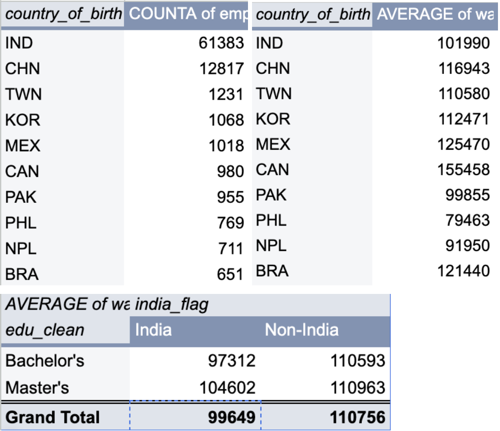
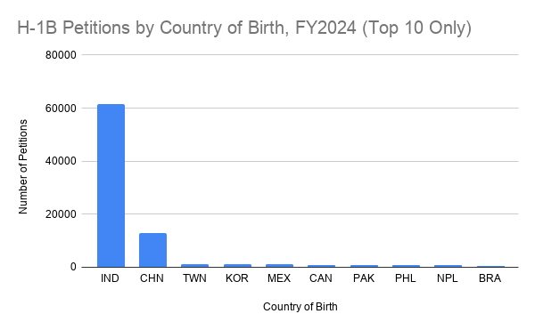
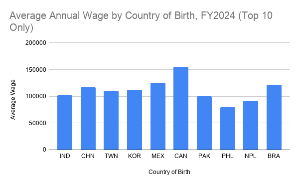
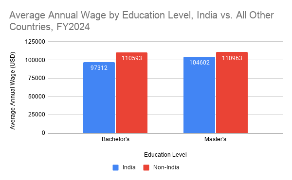

# **The Country That Sends the Most H-1B Workers Pays Them the Least**

## ***Indian workers dominate the skilled-visa program, and yet earn less than their peers even with the same degree***

By Maya Stern  |  JOURN 124, UC Berkeley  |  July 6, 2026

## **Introduction**

My mother immigrated to the US from Thailand, and her parents before her, and yet even after watching my mom go through the process of earning her citizenship, while mine was automatically assigned to me at birth, I had never really internalized what that citizenship spared me until very recently.

I spent all of my years in college in a professionally focused business fraternity focused on training members to recruit for investment banking, and eventually investing later down the road. For my international friends, however, rules were completely different; needing visa sponsorship was almost like an automatic ding against you. It raised the bar you had to clear and some banks / seats were closed to international candidates entirely because they’d refuse to sponsor. It was even harder to find sponsorship for buyside seats coming out of 2-year banking analyst programs, especially given the already dwindling number of seats in general due to higher borrowing costs and the resulting dealmaking slowdown. For so many of my friends, an H-1B wasn’t a technicality, but rather their lifeline – the thing that determined whether or not they could stay in the country at all those first years out of school. 

I wanted to understand this intricate system that so much of my friends’ and even my mom’s future hinged on, so I decided to take a look at the data behind it in 2024\.

## **Where the Data Came From**

The dataset I found was produced by US Citizenship and Immigration Services (USCIS), which is the federal agency that administers the H-1B program. Something that’s really interesting is the data actually wasn’t released voluntarily – Bloomberg News had to sue the Dept. of Homeland Security for it under the Freedom of Information Act. Bloomberg then published the records on GitHub as part of its 2024 investigation into how staffing firms game the visa lottery. This dataset in particular covers every lottery registration and petition for fiscal years 2021 through 2024, but I chose to focus my project on the FY2024 selected petitions, because I wanted to look at something other than the system being games; whether or not there was a significant wage gap by country of birth of those sponsored that couldn’t simply be explained away by education.

Given that these are government administration records, the underlying numbers are definitely very trustworthy, and this is the official account of who filed what. But I should mention that since the data reached the public through a news organization pursuing a specific story about “middlemen gaming the system,” there could be some bias and USCIS purposefully redacted some personally identifying details. We also need to remember that this analysis is a snapshot of a single fiscal year and not a trend over time.

## **Challenges**

The biggest challenge I encountered was definitely the size and complexity of the dataset; it spanned \~1.8M rows across 4 years, which was way too large to open in Sheets, so I narrowed it to the FY2024 selected petitions, which brought it down to a much more workable 92,120 rows. The data was also messy so I had to clean it before I started any analysis; e.g. wages were reported in different units (yearly, hourly, monthly, etc.) and thus raw avg. would’ve been meaningless. Some wage entries had obvious errors, and thousands of rows had blank job titles / education levels. All of these issues required me to make judgement calls about how exactly to standardize / exclude, etc., which I will describe in the analysis below.

## **Data Analysis & Process**

I did all my analysis in Sheets; I started by importing the 92,120 raw FY2024 petition rows, and then I made several cleaned / helper columns to prep the data for my analysis. Here are the steps I took to clean the data:

1. Standardized wages to an annual figure – wrote formula to convert every salary to an annual number (hourly \* 2,080, monthly \* 12, weekly \* 52\) so they could be compared in apples to apples  
2. Removed implausible / outlier wage values – excluded any value outside a plausible $10,000 – $1,000,000 range (this removed 335 error rows)  
3. Handled blank fields by labeling blank job titles “Not recorded” using an ISBLANK formula  
4. Created helper columns – one to group workers by country (India vs. all others), and then also one to simplify education levels into clean categories (Bachelor's, Master's, etc.). Allowed me to compare pay while holding education constant

Having cleaned the data, then I moved on to making pivot tables; I built 3 pivot tables:

1. Petitions by country of birth  
2. Average wage by country of birth  
3. Average wage for Indian v. non-Indian workers at each education level (Bachelor v. Master’s)

Google Sheet: [https://docs.google.com/spreadsheets/d/1oNCwtR-KHDQLuqAFNq1R8CW4LDXzF0uDZ9RzdgU1H0M/edit?usp=sharing](https://docs.google.com/spreadsheets/d/1oNCwtR-KHDQLuqAFNq1R8CW4LDXzF0uDZ9RzdgU1H0M/edit?usp=sharing)

## **Findings**

The first thing that you can clearly see is how dramatically concentrated the H-1B data is. Of all 92,120 approved petitions from the FY2024 lottery, there was a staggering 67% made up by workers born in India, with the next highest proportion being those born in China, at 14%. This means that over 80% of the entire program came from just 2 countries, with the rest of the world just sharing what’s leftover.

 
While this may seem pretty wild, the number of approved petitions being highly concentrated on applicants from one country does not actually tell us that much on its own, especially given that the H-1B selection process is a random lottery – meaning the share of visas a country wins is really just a reflection of how many applications it submits. This being said, it follows that India / China dominate the results given they dominate the applicant pool. Something that’s really interesting is that in 2024, India’s and China’s populations were very nearly tied (\~1.4B) (China Data Portal), and yet India sent \~5x more H-1B petitions. 

While the numbers can’t tell us any information about motivation, this tells us that population alone does not explain it. It alludes to India’s dominance coming from a specific ecosystem – a huge English-language IT-education system producing engineers, as well as the huge Indian IT-outsourcing industry whose entire business model is basically placing Indian tech workers at US client sites (an industry that’s literally *built* to move workers through H-1B). Meanwhile, China has world-class STEM output; and they may have less of this sort of outsourcing-staffing machinery that India has, but it does have more skilled graduates entering via student visas converting to H-1B individually rather than through staffing firms. It is also likely related to the fact that H-1B is super concentrated in tech occupations and these 2 countries are the largest sources of international STEM talent, so it makes sense why they’re overrepresented relative to population in this occupation-specific visa.

## **A Wage Gap the Lottery Can’t Explain**

Selection may’ve been left to chance… but wages are of course not; they’re set by employers. And this is where the data gets interesting; despite sending by *far* the most workers, Indian-born beneficiaries earned among the lowest avg. salaries of ANY major group (\~$102K) – below China (\~$116K), Mexico ($125K), and well below Canada which came in at the highest-paid major group at \~$155K. 

Some may argue that this disparity may just be because of differences in education, like maybe Indian applicants hold fewer advanced degrees. So I decided to test this directly by comparing Indian and non-Indian workers at the *same* education level, but the gap did NOT disappear. 

As you can see above, amongst workers with a bachelor’s degree, Indian nationals had an avg. wage of $97K compared to $111K for everyone else – this is a gap of about $14K for the same credential. And at the master’s level, the gap does narrow a bit, but it still persists: $105K v. $111k. This showed that in FY2024, an advanced degree reduced the wage disadvantage for Indian H-1B winners, but it did *not* erase it. And this means that whatever is driving this gap, it’s not education, and unlike the country counts, this pattern isn’t just an artifact of who applied.

And this brings us back to our hypothesis about the numbers likely being tied to the massive IT-staffing / outsourcing firms (companies such as Infosys, Cognizant, Tata, etc.) that funnel huge numbers of Indian tech workers into US jobs at lower wage tiers. The 2024 Bloomberg News investigation further documents this pattern, and how these firms flood the lottery with registrations, plus place workers at 3P client sites (often at lower end of the pay scale). So while I was just looking at one end of the H-1B wage spectrum in my business fraternity, seeing my friends find their way to very high-paying jobs they are lucky to have, this does *not* tell the whole story of wage distribution. In reality, there is a huge share of petitions that sit far below this.

Read more here: https://www.bloomberg.com/graphics/2024-staffing-firms-game-h1b-visa-lottery-system/

## **Summary, Limitations, & Ethics**

Through this analysis, we found that 4 in 5 H-1B visas go to workers from just 2 countries – India and China. And yet this turns out to be the least meaningful thing about the data; it tells us about how many people from different countries apply, and not anything about the selection process. In conclusion, what’s most interesting about the data, is that Indian workers, the largest group by far, earn among the least – and this gap holds even when comparing people with the same degree. 

Having said that, it’s really important to acknowledge that this project does not come without its limitations; the largest and most gaping one is that this analysis is limited to a single year of data, and so it can’t reveal any trends over time. Another one is that an approved petition isn’t the same thing as a hire / a paid salary; it’s a legal authorization and the listed wage is what the employer just proposed with the application, so it doesn’t necessarily reflect exactly what was paid. Finally, looking at my last chart, I added the education level component in almost as a control to demonstrate that the wage gap for Indians couldn’t be explained by population. But the truth is that it’s really not a perfect apples-to-apples test, because within a category like “bachelor’s degree” Indian v. non-Indian workers could still differ by job type, seniority, location, etc. The data shows us that a gap does in fact remain at the same education level, but not that identical workers are paid differently for identical work – we can’t draw that conclusion with this limited data.

There’s no question that this story carries a huge, and very real ethical responsibility; it’s one I feel personally responsible for given my own family’s history, and how long it took me to stop taking my birthright citizenship for granted. Data that shows a heavy concentration of workers from India / China could so easily be misread in ways that stigmatize immigrants / particular nationalities; in fact, I even initially misinterpreted the data myself looking at this staggering proportion of Indian / Chinese H-1B winners, forgetting for a second that it is a lottery, and is simply reflective of the number of applications by birth country. The concentration reflects how the program and the global tech-labor pipeline are structured – how it’s driven by employer recruitment, by the business models of outsourcing firms, things like this. And not by anything about the workers themselves, who’re following a legal process in good faith, exactly as my mom and friends did. A more holistic and complete story would definitely require more years of data as well as ideally interviewing H-1B workers about their real pay / conditions, as well as speaking to major sponsoring firms and cross-referencing all of this data with Department of Labor wage data. 

## **References**

Fan, E., & Mider, Z. (2024, July 31). *Thousands of US work visas are going to middlemen gaming the system.* Bloomberg. [https://www.bloomberg.com/graphics/2024-staffing-firms-game-h1b-visa-lottery-system/](https://www.bloomberg.com/graphics/2024-staffing-firms-game-h1b-visa-lottery-system/)

U.S. Citizenship and Immigration Services. (2024). *H-1B visa lottery and petition data, FY 2021–FY 2024* \[Data set\]. Obtained by Bloomberg News via Freedom of Information Act litigation. [https://github.com/BloombergGraphics/2024-h1b-immigration-data](https://github.com/BloombergGraphics/2024-h1b-immigration-data)

Vine, J. S. (2024, August 21). *H-1B lotteries, multinational corporations, California residential water supply, UK grantmakers, and Olympic medalists.* Data Is Plural. [https://www.data-is-plural.com/archive/2024-08-21-edition/](https://www.data-is-plural.com/archive/2024-08-21-edition/)

World Population Review. (n.d.). *China population vs. India.* China Data. Retrieved July 6, 2026, from [https://chinadata.live/data/china-population-vs-india/](https://chinadata.live/data/china-population-vs-india/)
